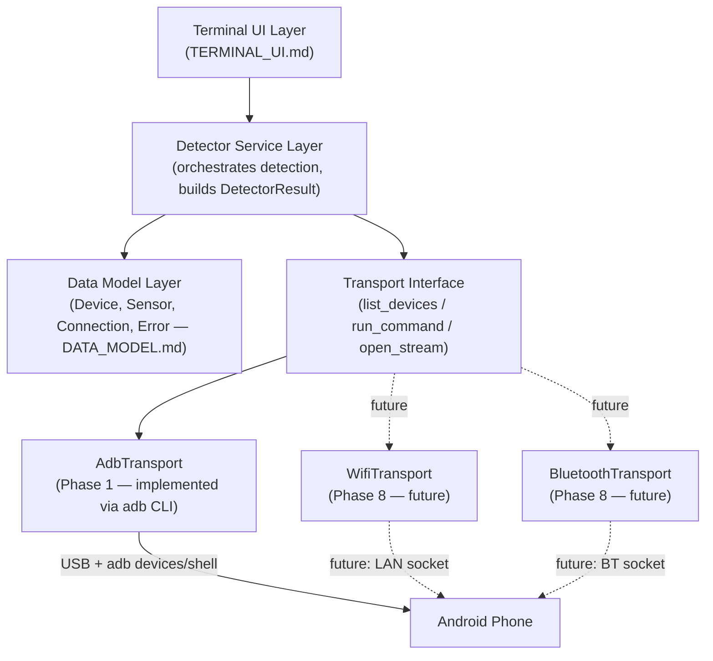

# Architecture

This document compares the possible ways the laptop and phone could talk to each other, explains which one Phase 1 uses and why, and defines a layered architecture so that later phases can add Wi-Fi/Bluetooth without rewriting the detector.

## Approach Comparison

| # | Approach | What it is | Pros | Cons | Verdict |
|---|---|---|---|---|---|
| 1 | **Pure ADB commands** | `adb devices`, `adb forward`, etc. — commands the ADB client/server handle directly, not run "inside" the phone's shell | Zero setup beyond USB debugging; official, stable, documented | Only gives connection-level info (serial, state), not device details | Used in combination with #2 |
| 2 | **ADB + Android shell commands** | `adb shell <cmd>` — runs a command inside the phone's shell (`getprop`, `dumpsys`) | No app install; access to build properties and system dumps; fast to prototype | Shell user has limited privileges; some dumps are undocumented/unstable | **✅ Chosen for Phase 1**, combined with #1 |
| 3 | **ADB + Android companion application** | A small app installed on the phone that uses Android SDK APIs (e.g. `SensorManager`) and talks to the laptop, tunneled through ADB | Only reliable way to get live sensor *values*; full access to documented Android APIs | Requires writing, installing, and trusting an app; adds a build step | Planned for **Phase 3** |
| 4 | **ADB port forwarding** | `adb forward` / `adb reverse` — tunnels a TCP port between laptop and phone over the existing USB/ADB link | Lets a companion app stream data over USB without any raw USB protocol work | Only useful once a companion app exists to be on the other end | Planned for **Phase 3–4**, as the transport under the companion app |
| 5 | **USB HID (phone as a native controller device)** | Phone's USB gadget mode presents itself as a HID game controller directly to Windows | Would need no companion software on the laptop at the OS level | Generally requires root/custom ROM support on the phone; not available on typical unrooted consumer devices — `NEEDS VERIFICATION` per device, likely infeasible for most users | Rejected/deferred — niche, high friction |
| 6 | **Wi-Fi** | Phone and laptop communicate over a local network socket | Fully wireless; works at range | Adds network complexity, latency variability, and requires pairing/security design | Planned for **Phase 8** |
| 7 | **Bluetooth** | Phone and laptop communicate over a Bluetooth (Classic or LE) link | Wireless; often lower idle power than Wi-Fi | More complex pairing APIs; throughput/latency trade-offs vs Wi-Fi need benchmarking | Planned for **Phase 8**, evaluated alongside Wi-Fi |

## Why Approach 2 (ADB + Shell Commands) for Phase 1

1. **It directly answers the current question.** The goal right now is discovery — "what does this phone have and can I see it from the laptop?" — not input latency or streaming. ADB shell commands answer that with zero extra software.
2. **Nothing to install on the phone.** The user only needs to flip one Developer Options toggle. This keeps the detector immediately usable and testable.
3. **It's honest about its own limits.** Because shell/`dumpsys` cannot stream live sensor values (see [`ADB_PROTOCOL.md`](ADB_PROTOCOL.md#limitations-for-real-time-sensor-streaming)), choosing it for Phase 1 doesn't create a false expectation — it naturally scopes Phase 1 to detection, and pushes live data to Phase 3 where a companion app is expected anyway.
4. **It doesn't block the future.** Because the detector's core logic is designed around a transport interface (below), replacing "ADB shell calls" with "companion app over a forwarded socket" later doesn't require touching the data model or UI.

## Layered Architecture

The application is split into layers so the communication mechanism can change without changing the layers above it.

**Key rule:** the Detector Service Layer and everything above it must only ever talk to the abstract **Transport Interface** — never call `adb` directly. `AdbTransport` is Phase 1's only implementation of that interface. Swapping in `WifiTransport` or `BluetoothTransport` later means writing a new class that satisfies the same interface; the service layer, data model, and UI stay untouched.

### Transport Interface (conceptual)

Not code yet — just the contract each transport implementation must satisfy:

- `list_devices()` → list of raw device identifiers + connection state
- `get_device_info(id)` → raw key/value properties for a device
- `get_sensor_dump(id)` → raw sensor listing text/data for a device
- `run_command(id, command)` → generic escape hatch for anything not covered above
- `open_stream(id, ...)` → *(Phase 3+)* opens a channel for continuous data (backed by `adb forward` in Phase 3–7, by a raw socket in Phase 8)

Phase 1 only needs the first three methods. `open_stream` is defined here now so the interface doesn't need a breaking change later — it simply isn't implemented until a companion app exists to be on the other end of it.

## Where Each File Fits

- Exact ADB commands and their limits → [`ADB_PROTOCOL.md`](ADB_PROTOCOL.md)
- What each sensor is and how it's detected → [`SENSOR_DETECTION.md`](SENSOR_DETECTION.md)
- The concrete shape of `Device`, `Sensor`, etc. → [`DATA_MODEL.md`](DATA_MODEL.md)
- How this layering extends into the full controller → [`FUTURE_CONTROLLER_ARCHITECTURE.md`](FUTURE_CONTROLLER_ARCHITECTURE.md)
