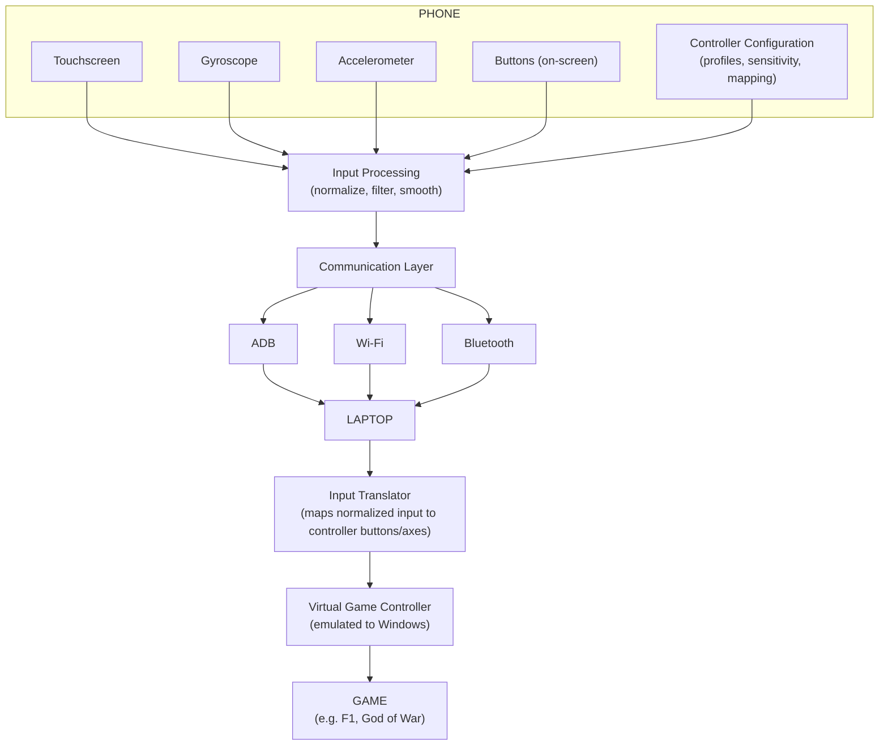

# Future Controller Architecture

How the Sensor Detector becomes the foundation of the full virtual game controller, without ever being rewritten to do it.

## Conceptual Architecture

This mirrors the Transport Interface layering already established in [`ARCHITECTURE.md`](ARCHITECTURE.md) — `COMM` here is the same abstract transport concept, just drawn from the full-product point of view instead of the detector's.

## Target Controller Feature Set

**Layout (PS5-style):**
- Left analog stick, Right analog stick
- D-pad
- Face buttons: Cross, Circle, Square, Triangle
- L1 / R1 (bumpers)
- L2 / R2 (triggers, ideally analog)
- L3 / R3 (stick clicks)
- Options, Create/Share

**Motion input:**
- Gyroscope-driven aim
- Accelerometer-driven gestures (e.g. shake, tilt-steer)

**Configuration:**
- Sensitivity (per-axis)
- Dead zones
- Smoothing
- Calibration (zeroing drift/offset)
- Axis inversion
- Custom button mapping
- Controller profiles (save/load named configurations)
- Game-specific modes, e.g. **F1/racing mode** (tilt-steering emphasis) vs. **standard gamepad mode** (stick-emphasis, D-pad-driven menus)

## How the Detector Becomes the Foundation

1. **Shared data model.** `Device`, `Sensor`, and `SensorReading` from [`DATA_MODEL.md`](DATA_MODEL.md) are exactly what the controller's Input Processing stage needs as its raw input contract — nothing about those models is detector-specific, so the controller consumes them as-is rather than redefining them.
2. **Shared transport abstraction.** The Transport Interface from [`ARCHITECTURE.md`](ARCHITECTURE.md) (`list_devices`, `get_device_info`, `get_sensor_dump`, `open_stream`) is reused directly — the controller's Communication Layer above is the same interface, just with `WifiTransport`/`BluetoothTransport` implementations filled in by Phase 8.
3. **The detector stays standalone.** It remains useful on its own forever — as a diagnostic tool to answer "what does my phone support?" independent of whether the controller is running. It is a dependency the controller uses, never the other way around.

## Avoiding Coupling

To keep the detector from becoming entangled with controller-specific logic as the project grows:

- **One-directional dependency only.** The controller application depends on the detector's data model and transport layer; the detector must never import or depend on anything controller-specific (input mapping, profiles, virtual device code).
- **Separate concerns into separate modules/packages**, e.g. conceptually: `core` (shared data model + transport interface), `detector` (this project — UI + detection logic), `controller` (input processing, mapping, virtual device emission — future), `companion-app` (the Android-side code, shared by both detector's live-mode and the controller once it exists).
- **No detector code should ever branch on "is this being used for the controller."** If the controller needs something the detector's models don't provide, that's a signal to extend the shared `core` model (per [`DATA_MODEL.md`](DATA_MODEL.md)'s design notes) — not to special-case the detector.
- **Configuration (sensitivity, dead zones, profiles, mapping) lives entirely in the controller layer.** The detector never needs to know these concepts exist; they operate purely on top of `SensorReading` data the detector/transport layer already produces.

This separation is why [`DEVELOPMENT_PLAN.md`](DEVELOPMENT_PLAN.md) sequences things the way it does: get detection solid and standalone first (Phases 1–2), prove the communication and streaming pattern next (Phases 3–5), and only then start building controller-specific logic on top (Phases 6–9) — at no point does an earlier phase need to be rewritten for a later one to work.
