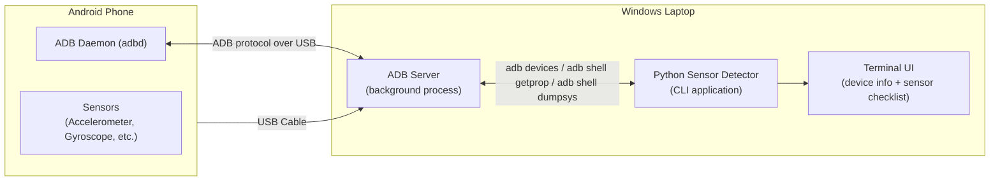

# Android Sensor Detector

A Windows-side diagnostic tool that discovers and inspects an Android phone connected over USB — as the foundation for a future PS5-style virtual game controller.

> **Status:** Design/documentation phase. No implementation code exists yet. This repository currently contains only planning documents.

## What This Project Is

This project has two objectives on two very different timelines.

**Right now**, it is a small **Android Sensor Detector**: a Python command-line tool that runs on a Windows laptop, talks to a connected Android phone over USB via ADB (Android Debug Bridge), and reports what the phone is and what sensors it has.

**Eventually**, it will grow into a full **virtual game controller**: the phone's touchscreen, gyroscope, and accelerometer will be used as input devices for PC games (e.g. *F1*, *God of War*), presented to Windows as a PS5-style gamepad with configurable button mapping, sensitivity, dead zones, gyro aiming, and per-game profiles — first over USB, later over Wi-Fi or Bluetooth.

Building the full controller directly would be risky: it mixes device discovery, sensor access, input processing, virtual-device emulation, and UI into one big unknown. The Sensor Detector de-risks the project by answering the first question in isolation: **"What can we actually see and read from this phone, and how?"**

## Current Objective (Phase 1)

Build a Python CLI on Windows that:

1. Detects whether an Android phone is connected via USB/ADB.
2. Identifies the device (manufacturer, model, Android version, SDK level, CPU architecture).
3. Detects which sensors the device reports having (accelerometer, gyroscope, etc.) and shows their static metadata.
4. Displays all of this in a readable terminal UI.
5. Fails gracefully and explains itself when something goes wrong (no device, unauthorized, ADB missing, etc.).

Phase 1 does **not** stream live sensor values, does not require an Android app to be installed, and does not touch game input in any way. See [`REQUIREMENTS.md`](REQUIREMENTS.md) for the precise scope.

## Long-Term Objective

A cross-platform virtual controller pipeline where a phone's sensors and touchscreen drive PC games in real time, with latency and reliability comparable to a wired physical controller, and with a UX comparable to consumer tools like DS4Windows or Steam Input. Full feature list in [`FUTURE_CONTROLLER_ARCHITECTURE.md`](FUTURE_CONTROLLER_ARCHITECTURE.md).

## Current Architecture (Phase 1)

There is exactly one communication path in Phase 1: **USB → ADB → Python**. No Wi-Fi, no Bluetooth, no Android app on the phone. See [`ARCHITECTURE.md`](ARCHITECTURE.md) for why this was chosen over the alternatives, and how it's structured so later phases can add other transports without a rewrite.

## How the Phone Communicates With the Laptop

The phone is connected with a USB cable. With **USB debugging** enabled in Developer Options, the phone runs a background process called `adbd` (the ADB daemon). On the laptop, the `adb` command-line tool talks to a local **ADB server** process, which in turn talks to `adbd` on the phone over the USB connection. All device queries in Phase 1 go through this path — there is no direct USB HID or raw USB communication. Full protocol details are in [`ADB_PROTOCOL.md`](ADB_PROTOCOL.md).

## What ADB Is Doing

ADB (Android Debug Bridge) is Google's official developer bridge between a computer and an Android device. In this project it is used for three things only:

- **Enumeration** — `adb devices` to see what's connected and in what state.
- **Property reads** — `adb shell getprop <key>` to read build/device properties (manufacturer, model, Android version, SDK level, CPU ABI).
- **Diagnostic dumps** — `adb shell dumpsys sensorservice` to list the sensors the device's sensor framework knows about.

ADB is **not** used to stream live sensor values in Phase 1 — see the limitations section of [`ADB_PROTOCOL.md`](ADB_PROTOCOL.md) for why.

## What the First Prototype Can and Cannot Do

**Can do:**
- Detect a connected phone and report its identity.
- Detect multiple connected phones and let you pick one.
- List sensors the phone's sensor framework reports, with whatever static metadata (vendor, version, range, resolution) the device exposes.
- Tell you clearly when something isn't available, rather than guessing.

**Cannot do (yet):**
- Stream live gyroscope/accelerometer numbers in real time.
- Read any data that Android does not expose through ADB shell / dumpsys.
- Communicate wirelessly (Wi-Fi/Bluetooth).
- Act as, or emulate, a game controller.
- Modify or configure anything on the phone.

## Current Development Status

Phase 1 through Phase 9 have now been implemented.
The project currently includes:
- A CLI tool (`python main.py`) for device discovery and sensor diagnostics (Phase 1-2).
- An Android Companion App built with Flutter (`companion_app/`) featuring a PS5-style layout (Phase 3-4, 9).
- A virtual gamepad bridge (vgamepad) translating sensor motions to Xbox inputs (Phase 6-7).
- A Desktop Configuration GUI (`python main.py --gui`) for profile selection and axis deadzone settings (Phase 9).

Full roadmap and milestone progress can be found in [`DEVELOPMENT_PLAN.md`](DEVELOPMENT_PLAN.md).

## Basic Setup Requirements

- Windows 10/11 laptop.
- Python 3.10+ (exact minimum to be confirmed at implementation time).
- [Android SDK Platform Tools](https://developer.android.com/tools/releases/platform-tools) (provides `adb.exe`), added to your `PATH`.
- An Android phone with **Developer Options → USB debugging** enabled.
- A USB cable capable of data transfer (not charge-only).
- USB driver for your phone's manufacturer, if Windows doesn't recognize it automatically (see [`TROUBLESHOOTING.md`](TROUBLESHOOTING.md)).

No Android Studio is required for Phase 1. It only becomes relevant once a companion Android app is built (Phase 3+), and even then Android Studio is a convenience, not a hard requirement — see [`README's Technology note`](#technology-choices-not-yet-finalized) below.

## Technology Choices (Not Yet Finalized)

- **Phase 1 (this repo):** Python 3, Windows, ADB, terminal/CLI. This part is locked in.
- **Future companion Android app:** framework not yet decided. Candidates include Flutter and native Kotlin; the choice will be made when Phase 3 starts, based on how easy each makes SensorManager access and socket communication.

## Document Map

| File | Purpose |
|---|---|
| [`REQUIREMENTS.md`](REQUIREMENTS.md) | Functional & non-functional requirements, phased |
| [`ARCHITECTURE.md`](ARCHITECTURE.md) | Technical architecture, transport comparison, decision rationale |
| [`SENSOR_DETECTION.md`](SENSOR_DETECTION.md) | How Android sensors work, sensor-by-sensor breakdown |
| [`ADB_PROTOCOL.md`](ADB_PROTOCOL.md) | Exact ADB communication details and limitations |
| [`DATA_MODEL.md`](DATA_MODEL.md) | Data structures (Device, Sensor, Connection, etc.) |
| [`TERMINAL_UI.md`](TERMINAL_UI.md) | Terminal UI design, static and future live views |
| [`DEVELOPMENT_PLAN.md`](DEVELOPMENT_PLAN.md) | Step-by-step milestone roadmap, incl. **Next Step** |
| [`TESTING.md`](TESTING.md) | Testing strategy across all phases |
| [`TROUBLESHOOTING.md`](TROUBLESHOOTING.md) | Common problems and how to diagnose them |
| [`SECURITY.md`](SECURITY.md) | Security considerations, current and future |
| [`FUTURE_CONTROLLER_ARCHITECTURE.md`](FUTURE_CONTROLLER_ARCHITECTURE.md) | How this detector becomes the controller's foundation |
